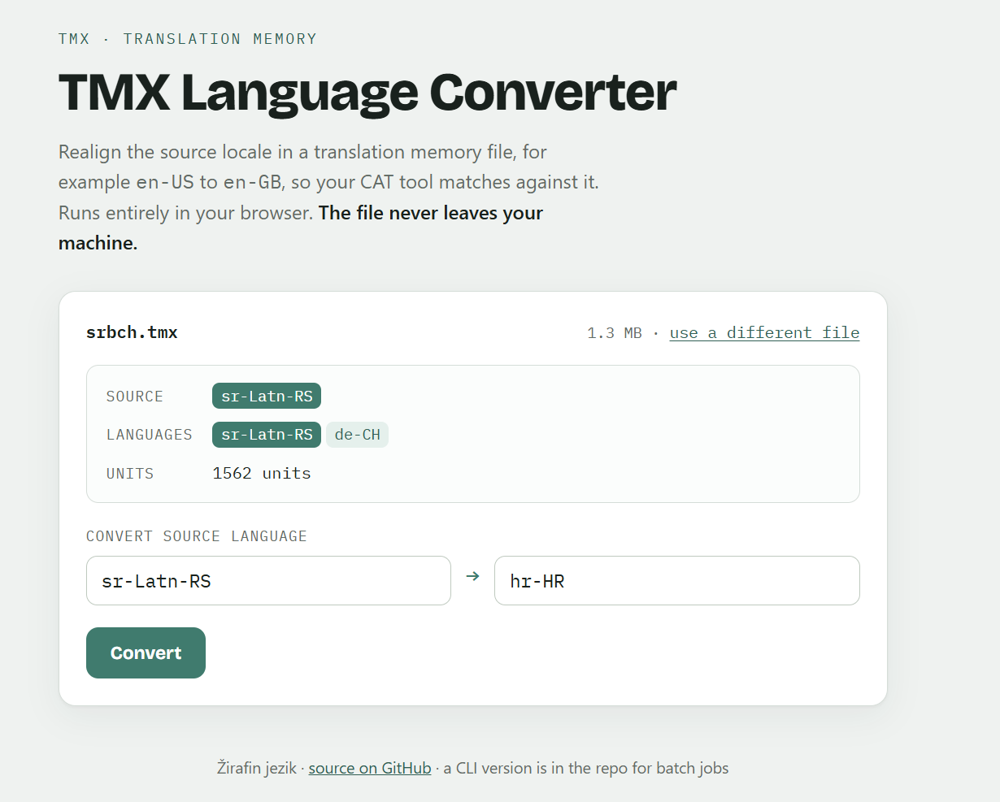

# TMX Language Conversion

Change the source language code in a TMX (Translation Memory eXchange) file, for example `en-US` to `en-GB`, across the header and every translation variant in one pass. For localization engineers and PMs who need to realign a translation memory to a different locale variant so their CAT tool will match against it.

**Live tool:** [tmx.zirafinjezik.hr](https://tmx.zirafinjezik.hr/)
**Repository:** [github.com/zirafinjezik/tmx-language-conversion](https://github.com/zirafinjezik/tmx-language-conversion)

Two ways to use it:

- **Browser tool** ([live](https://tmx.zirafinjezik.hr/)) for one-off conversions. Drop a TMX in, check the locales it contains, pick a new source code, download the corrected file.
- **Python CLI** (`scripts/convert_language_code.py`) for scripted and batch jobs, with no dependencies.

Both change only the `srclang`, `adminlang`, and matching `xml:lang` attributes. Everything else, including formatting, whitespace, and entities, stays byte-for-byte identical to the source, which is what a CAT tool expects from a TM file.

---

## Screenshot



---

## Why This Exists

CAT tools like Trados Studio and memoQ match a TM against a project by language code. A TM created with `en-US` as the source will not match a project set to `en-GB`, even when the content is identical. So when a client switches source locale mid-project, or a US team hands a TM to a UK workflow, every TM has to be realigned before import. Editing large TMX files by hand is slow and easy to get wrong. This does it in one pass.

---

## Browser Tool

Open [the live tool](https://tmx.zirafinjezik.hr/) (or `index.html` locally). Drop in a TMX file and it reads the header source language, lists every locale present, and counts the translation units. A TM health readout shows per-language segment counts with missing variants flagged, empty segments, and duplicate source segments, the things worth checking before importing a TM. Pick a from/to code (common locales are suggested, or type any BCP-47 tag), convert, and download.

The file is parsed and rewritten entirely in your browser. Nothing is uploaded, and there is no server. The tool reads the file with the browser's XML parser to detect its locales and flag malformed XML, then applies the code change with targeted replacement so the output differs from the source only in the codes.

---

## Python CLI

**Requirements:** Python 3.x, no external dependencies.

```bash
git clone https://github.com/zirafinjezik/tmx-language-conversion.git
cd tmx-language-conversion
python scripts/convert_language_code.py input.tmx output.tmx --from en-US --to en-GB
```

Any pair works, not just en-US to en-GB. The script reports how many attributes it changed and refuses to write an output file when the from code isn't found, so a typo can't silently produce an unchanged copy.

Run the tests with:

```bash
python -m unittest scripts.test_convert
```

This covers every place the source code appears in a standard TMX file: the `<header>` metadata and all `<tuv>` translation variant elements.

---

## Repository Structure

```
tmx-language-conversion/
├── index.html                     # Browser tool (no build, no dependencies)
├── scripts/
│   ├── convert_language_code.py   # Python CLI for batch jobs
│   └── test_convert.py            # Unit tests for the CLI (7 tests)
├── sample_tmx/
│   ├── original_en-US.tmx         # Sample TMX with en-US source language
│   └── converted_en-GB.tmx        # Converted output with en-GB source language
├── documentation/
│   └── README.md                  # TMX structure reference
├── screenshot/
│   └── Screenshot.png             # Browser tool screenshot used in this README
├── LICENSE
└── README.md
```

---

## TMX Structure Reference

TMX is an XML-based standard for exchanging translation memory data. A TMX file contains:

| Element | Purpose |
|---|---|
| `<header>` | File metadata including `srclang` and `adminlang` |
| `<body>` | Container for all translation units |
| `<tu>` | A single translation unit (one source plus one or more targets) |
| `<tuv>` | A translation variant, identified by `xml:lang` |
| `<seg>` | The translated text segment |

---

## Limitations

- The **CLI** uses plain string replacement. It is reliable for standard TMX files but assumes conventional attribute formatting (no unusual whitespace around `=`). The **browser tool** parses the file first, so it also validates well-formedness and reports the locales it finds.
- Neither validates output against the TMX 1.4 schema.
- Built and tested against SDL Language Platform / Trados Studio TMX output.

---

## Author

**Natalija Marić**, localization engineer and LQA specialist with 14+ years in game localization, technical translation, and quality assurance.

- 🦒 [Žirafin jezik j.d.o.o.](https://zirafinjezik.hr)
- 💼 [LinkedIn](https://www.linkedin.com/in/natalija-maric-zirafinjezik)

---

## Privacy

The browser tool processes TMX files entirely in your browser; file contents are never uploaded, stored, or transmitted. The Python CLI runs on your own machine. For confidential TMs you can also run the browser tool offline: it is a single self-contained HTML file. Hosting (Vercel) logs standard access data such as IP addresses, never file content.

## License

MIT
